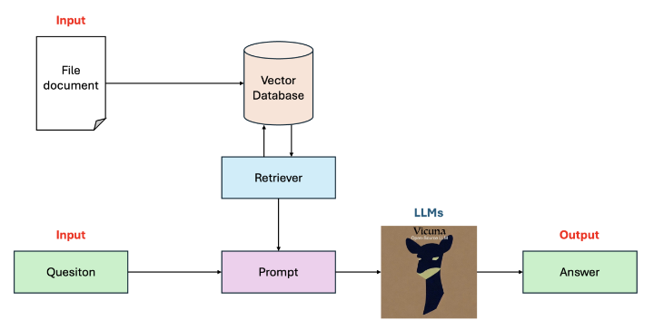

# QA-with-PDF-files-using-RAG

## Purpose
Question-Answering contents from PDF file using RAG
* Input: And pdf file for asking content and questions related to document contents
* Output: the answer

## Pipeline
Full pipeline for build the system

Pipeline for build vector database from pdf files

Simulate how the big documents is splitted into small chunk.

## How to run the application
T.B.D

## Limitation
* TODO: cannot download dataset from download link use gdown
* TODO: Fail Sonar check